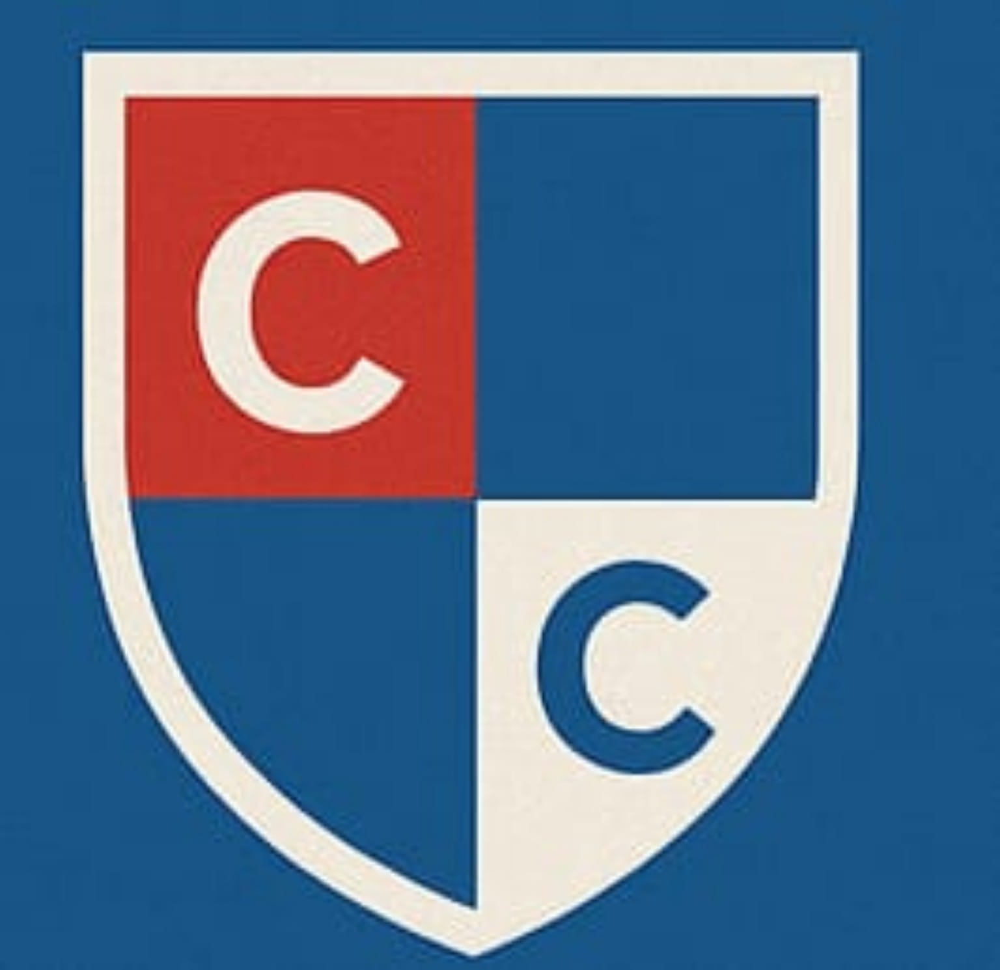

# Colegio Charlot — Sitio Web Institucional

<p align="center">
  
</p>

<h3 align="center">
  Sitio web institucional del Colegio Charlot de Zipaquirá
</h3>

<p align="center">
  Diseño web moderno, responsive y orientado a la presentación institucional,
  propuesta educativa, admisiones y contacto con la comunidad.
</p>

---

## Sobre el proyecto

Este proyecto corresponde al desarrollo del **sitio web institucional del Colegio Charlot**, una institución educativa de educación primaria.

El objetivo es proporcionar una presencia web clara, moderna y profesional donde padres de familia, acudientes y visitantes puedan conocer la institución, su propuesta educativa, actividades, valores, eventos y canales de contacto.

El proyecto fue desarrollado con una arquitectura frontend sencilla y modular, adecuada para un sitio institucional estático.

---

## Características

### Página de inicio

* Presentación institucional del Colegio Charlot.
* Sección principal de bienvenida.
* Acceso rápido a las diferentes áreas del sitio.
* Llamados a la acción para procesos de inscripción y contacto.

### Nosotros

* Información general de la institución.
* Presentación de la identidad institucional.
* Filosofía y enfoque educativo.
* Valores institucionales.
* Objetivos.

### Propuesta educativa

Se presenta la propuesta académica y formativa del colegio mediante diferentes secciones visuales para facilitar la lectura de la información.

### Festival de Teatro

Sección dedicada al **Festival de Teatro Infantil Charlot**, donde se presenta:

* Historia del festival.
* Actividades artísticas.
* Obras realizadas por los estudiantes.
* Reconocimientos.
* Fotografías de las actividades.

### Galería

Galería visual con fotografías reales del colegio y sus actividades.

Las imágenes están almacenadas localmente dentro de la carpeta `img/`, evitando depender de imágenes externas.

### Admisiones

Sección orientada a padres y acudientes interesados en conocer el proceso de inscripción y solicitar información.

### Formulario de contacto

Formulario diseñado para permitir que los visitantes puedan solicitar información y establecer contacto con la institución.

El formulario puede integrarse con un servicio externo de recepción de formularios, permitiendo mantener el proyecto como un sitio frontend estático sin necesidad de implementar un backend para esta funcionalidad.

### Diseño responsive

El sitio está preparado para adaptarse a diferentes tamaños de pantalla:

* Computadores.
* Portátiles.
* Tablets.
* Dispositivos móviles.

---

## Tecnologías utilizadas

| Tecnología   | Uso                                |
| ------------ | ---------------------------------- |
| HTML5        | Estructura y contenido             |
| CSS3         | Diseño, estilos y responsive       |
| JavaScript   | Interactividad                     |
| Font Awesome | Iconografía                        |
| Google Fonts | Tipografías                        |
| Git          | Control de versiones               |
| GitHub       | Repositorio y gestión del proyecto |

---

## Identidad visual

El diseño utiliza los colores institucionales del Colegio Charlot como base visual:

| Color              | Código    |
| ------------------ | --------- |
| Azul institucional | `#195587` |
| Rojo institucional | `#c33527` |
| Blanco             | `#FFFFFF` |

La combinación busca mantener una identidad visual coherente en navegación, botones, elementos destacados, títulos y componentes interactivos.

---

## Estructura del proyecto

```text
colegio-charlot/
│
├── index.html
│
├── css/
│   └── styles.css
│
├── js/
│   └── script.js
│
├── img/
│   ├── logo.jpeg
│   ├── teatro_01.jpeg
│   ├── teatro_02.jpeg
│   ├── teatro_03.jpeg
│   ├── teatro_04.jpeg
│   ├── teatro_05.jpeg
│   ├── teatro_06.jpeg
│   ├── teatro_07.jpeg
│   ├── teatro_08.jpeg
│   └── teatro_09.jpeg
│
└── README.md
```

> Los nombres de los archivos pueden variar dependiendo de la organización final del proyecto.

---

## Estructura de la página

El sitio está organizado mediante diferentes secciones:

```text
Inicio
 │
 ├── Nosotros
 │   ├── Información institucional
 │   ├── Filosofía
 │   ├── Valores
 │   └── Objetivos
 │
 ├── Propuesta
 │   └── Propuesta educativa
 │
 ├── Festival
 │   ├── Historia
 │   ├── Fotografías
 │   ├── Obras
 │   └── Reconocimientos
 │
 ├── Admisiones
 │   ├── Información
 │   └── Solicitud de información
 │
 ├── Galería
 │   └── Fotografías institucionales
 │
 └── Contacto
     ├── Formulario
     ├── WhatsApp
     └── Correo electrónico
```

---

## Componentes principales

### Header

El encabezado contiene:

* Logo institucional.
* Nombre del colegio.
* Navegación principal.
* Acceso a inscripciones.
* Menú responsive para dispositivos móviles.

### Hero

La sección principal presenta el colegio y dirige al visitante hacia las acciones principales del sitio.

### Cards informativas

Se utilizan tarjetas para presentar información de manera visual y organizada.

Ejemplos:

* Historia.
* Fotografías.
* Obras presentadas.
* Reconocimientos.

### Galería

Las fotografías se organizan mediante un sistema de tarjetas visuales, utilizando una imagen principal destacada y diferentes imágenes secundarias.

### Footer

El pie de página reúne información institucional y accesos importantes del sitio.

---

## Accesibilidad y buenas prácticas

El proyecto incorpora diferentes prácticas básicas de desarrollo web:

* Uso de etiquetas HTML semánticas.
* Atributos `alt` en imágenes.
* Diseño adaptable.
* Navegación mediante enlaces internos.
* Botones con etiquetas `aria-label` cuando es necesario.
* Organización de estilos mediante clases reutilizables.
* Separación de HTML, CSS y JavaScript.
* Uso de rutas relativas para recursos locales.

---

## Instalación y ejecución

Este proyecto no requiere un backend para ejecutarse.

Clona el repositorio:

```bash
git clone https://github.com/overrun1026/NOMBRE-DEL-REPOSITORIO.git
```

Entra al proyecto:

```bash
cd NOMBRE-DEL-REPOSITORIO
```

Puedes abrir directamente:

```text
index.html
```

También puedes utilizar una extensión como **Live Server** para ejecutar el sitio durante el desarrollo.

---

## Desarrollo

El proyecto está pensado para poder evolucionar progresivamente.

Entre las posibles ampliaciones se encuentran:

* Integración de formularios con servicios externos.
* Sistema de gestión de contenidos.
* Backend para administración institucional.
* Base de datos.
* Sistema de usuarios.
* Gestión de estudiantes y profesores.
* Gestión de cursos y materias.
* Sistema de admisiones.
* Panel administrativo.
* Integración con servicios de comunicación.

De esta manera, el sitio institucional puede convertirse posteriormente en la interfaz pública de un sistema educativo más completo.

---

## Estado del proyecto

**Estado:** En desarrollo

Actualmente se encuentra implementada la interfaz institucional y las principales secciones informativas del sitio.

Las futuras funcionalidades dinámicas podrán incorporarse mediante servicios externos o mediante un backend propio, dependiendo de las necesidades de la institución.

---

## Objetivo del proyecto

Este proyecto busca combinar:

* Diseño UX/UI.
* Desarrollo frontend.
* Responsive design.
* Organización modular del código.
* Buenas prácticas de HTML y CSS.
* Control de versiones con Git.
* Preparación para futuras integraciones backend.

El resultado es una base escalable para la presencia digital del Colegio Charlot.

---

## Autor

**Overrun**

Desarrollador de software enfocado en desarrollo web, programación y tecnologías DevOps.

GitHub:

**https://github.com/overrun1026**

---

## Licencia

Este proyecto fue desarrollado para fines institucionales y de portafolio.

El contenido, identidad visual, fotografías y materiales pertenecientes al Colegio Charlot son propiedad de sus respectivos titulares.
